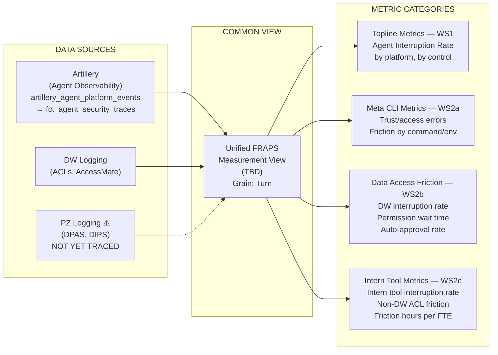

# FRAPS Measurement Architecture

## Overview

Three data sources converge into a unified view, which feeds four downstream metric categories aligned to FRAPS workstreams. The core metric across all workstreams is **Agent Interruption Rate** — the % of agent turns impacted by enforcing Security or Privacy controls.

## Diagram (Mermaid)



## Diagram (ASCII)

```
DATA SOURCES                    COMMON VIEW                     METRIC CATEGORIES (by Workstream)
─────────────                   ───────────                     ────────────────────────────────

┌─────────────────────────┐
│  Artillery              │──┐
│  (Agent Observability)  │  │
│                         │  │
│  artillery_agent_       │  │
│  platform_events:infra  │  │
│  ──────────────────▶    │  │
│  fct_agent_security_    │  │
│  traces:security        │  │
└─────────────────────────┘  │
                             │  ┌─────────────────────┐    ┌──────────────────────────────────┐
┌─────────────────────────┐  ├─▶│                     │    │  Topline Metrics (WS1)           │
│  DW Logging             │──┤  │  Unified FRAPS      │───▶│  - Agent Interruption Rate       │
│  (Warehouse access,     │  ├─▶│  Measurement View   │    │  - Interruption rate by platform  │
│   ACL checks,           │  │  │  (TBD)              │    │  - Interruption rate by control   │
│   AccessMate)           │  │  │                     │    │                                  │
└─────────────────────────┘  │  │  Grain: Turn        │    │  Meta CLI Metrics (WS2a)         │
                             │  │  (prompt → response │───▶│  - CLI trust/access errors       │
┌─────────────────────────┐  │  │   cycle)            │    │  - Friction by command/env        │
│  PZ Logging             │──┘  │                     │    │                                  │
│  (DPAS, DIPS,           │     └─────────────────────┘    │  Data Access Friction (WS2b)     │
│   privacy controls)     │                               ───▶│  - DW interruption rate          │
└─────────────────────────┘                                │  - Permission request wait time  │
                                                           │  - Auto-approval rate            │
                                                           │                                  │
                                                           │  Intern Tool Metrics (WS2c)      │
                                                          ───▶│  - Intern tool interruption rate  │
                                                           │  - Non-DW ACL friction           │
                                                           │  - Friction hours per Tech FTE   │
                                                           └──────────────────────────────────┘
```

## Data Sources

**Artillery (Agent Observability)** — Primary source. E2E telemetry on user ↔ agent ↔ risk platform interactions. Three levels of granularity:
- **Session**: overall conversation between user and agent
- **Turn**: one prompt → response cycle within a session
- **Span**: individual operations within a turn (LLM calls, tool calls, service calls)

Raw events land in `artillery_agent_platform_events:infrastructure`, then get enriched with risk platform signals into `fct_agent_security_traces:security`. Coverage is Artillery-dependent — currently deepest on Claude Code, with Metamate/DevMate/Confucius to follow.

**DW Logging** — Warehouse access events: ACL checks, AccessMate permission requests/approvals, data sensitivity classifications. Needed to measure WS2b (Data Access Friction) and to attribute access interruptions back to agent sessions.

**PZ Logging (DPAS/DIPS)** — Privacy control enforcement signals. **Known gap**: DPAS/DIPS interactions are not currently traced in the Artillery observability solution. Inventory of privacy/AIDRE controls and a gap analysis are needed before this source can be integrated.

## Common View

TBD — needs discussion. Key questions:
- What form does this take? (Hive table, semantic model, materialized view?)
- How do we join DW and PZ signals back to Artillery sessions/turns? (trace/session ID propagation)
- Grain is the **turn** (prompt → response cycle) — chosen to proxy user experience, since sessions can span days and contain multiple friction events
- How fresh does this need to be?

## Metric Categories

### Topline Metrics (WS1: Identify, Detect, Triage)
- **Agent Interruption Rate**: % of turns impacted by any enforcing Security/Privacy control
- De-averaged by: agent platform, control type, workstream
- No hard/soft interrupt distinction at topline (teams can split locally)
- No efficiency weighting for now (no Total Friction Hours equivalent yet)

### Meta CLI Metrics (WS2a: CLI Friction Reduction)
- Friction measurement for CLI developer and production workflows
- Baseline friction separated from expected friction (e.g., DSS-4 blocking sensitive data)
- Trust/access error rates by command, environment (Mac, Linux, Sandcastle)

### Data Access Friction Metrics (WS2b: Agent DW Access)
- Agent interruption rate scoped to data access turns
- Permission request volume and wait time
- AccessMate auto-approval rate (target: +50% improvement)
- Claude-specific target: reduce interruption rate from 4.1% to ≤2%

### Intern Tool Metrics (WS2c: Intern Tools & Infra)
- Interruption rate on internal tools and non-DW asset classes
- SIR precision/recall for top friction asset classes (Hive, Internal Tools)
- Friction hours per Tech FTE (target: 13.1 → 6.5)

## Known Gaps and Open Questions

1. **PZ Logging not traced**: DPAS/DIPS signals aren't in the Artillery pipeline yet. Need inventory of privacy/AIDRE controls and a plan to instrument them.
2. **Common view undefined**: No decision yet on physical form, join strategy, or refresh cadence.
3. **Platform coverage uneven**: Artillery coverage is deepest on Claude Code. Metamate, DevMate, Confucius coverage is in progress — onboarding cost should trend toward ~0 per the observability strategy.
4. **No efficiency weighting**: The interaction model between users and agents is still evolving, so no Total Friction Hours equivalent yet.
5. **Hard vs. soft interrupt**: Not differentiated at topline. For some controls (Access Management), determining hard vs. soft requires major investment in error code logging.
